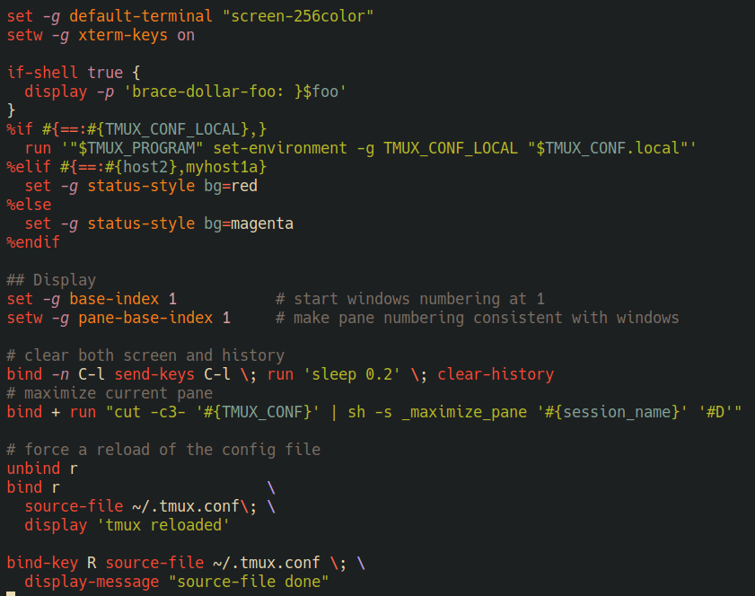

# Major mode for tmux files

[](https://www.gnu.org/licenses/gpl-3.0)

Major mode for tmux configuration files.

Features:
- font-locking
- indentation
- completion-at-point
- eldoc



## Installing

### Install tmux-mode.el from source

- Clone this repository
- Add the following to your emacs config

```elisp
(require "[cloned nverno/tmux-mode]/tmux-mode.el")
```
